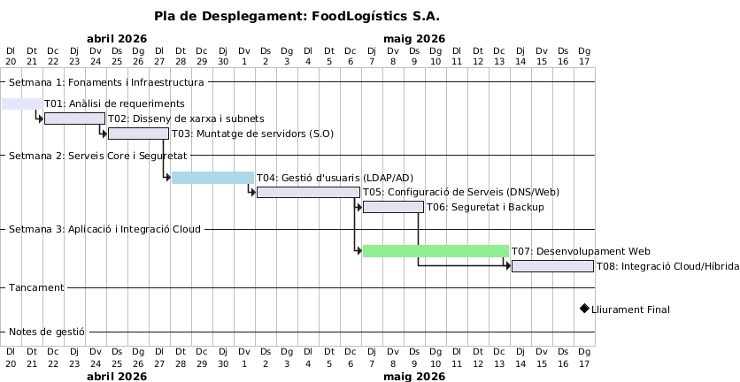

# T09: Estimació temporal de projecte (Diagrama de Gantt professional)

### Informe de Planificació: Projecte FoodLogístics S.A.
1. Introducció i Context
Aquest document detalla la planificació estratègica per al desplegament de la nova infraestructura tecnològica de FoodLogístics S.A. L'objectiu principal és transformar la proposta tècnica en una realitat operativa en un termini de 3 setmanes, garantint la coordinació de l'equip i la mitigació de riscos tècnics.

2. Diagrama de Gantt Professional
La següent visualització representa el cronograma del projecte, les dependències entre tasques i l'encadenament lògic de les fases.

# Pla de Desplegament: FoodLogístics S.A.

### Diagrama de Gantt (Codi PlantUML)
plantuml
@startgantt
language ca
title Pla de Desplegament: FoodLogístics S.A.
printscale daily zoom 1.5

project starts 2026-04-20

-- Setmana 1: Fonaments i Infraestructura --
[T01: Anàlisi de requeriments] lasts 2 days
[T02: Disseny de xarxa i subnets] lasts 3 days
[T01: Anàlisi de requeriments] -> [T02: Disseny de xarxa i subnets]
[T03: Muntatge de servidors (S.O)] lasts 3 days
[T02: Disseny de xarxa i subnets] -> [T03: Muntatge de servidors (S.O)]

-- Setmana 2: Serveis Core i Seguretat --
[T04: Gestió d'usuaris (LDAP/AD)] lasts 4 days
[T03: Muntatge de servidors (S.O)] -> [T04: Gestió d'usuaris (LDAP/AD)]
[T05: Configuració de Serveis (DNS/Web)] lasts 5 days
[T04: Gestió d'usuaris (LDAP/AD)] -> [T05: Configuració de Serveis (DNS/Web)]
[T06: Seguretat i Backup] lasts 3 days
[T05: Configuració de Serveis (DNS/Web)] -> [T06: Seguretat i Backup]

-- Setmana 3: Aplicació i Integració Cloud --
[T07: Desenvolupament Web] lasts 7 days
[T05: Configuració de Serveis (DNS/Web)] -> [T07: Desenvolupament Web]
[T08: Integració Cloud/Híbrida] lasts 4 days
[T06: Seguretat i Backup] -> [T08: Integració Cloud/Híbrida]
[T07: Desenvolupament Web] -> [T08: Integració Cloud/Híbrida]

-- Tancament --
[Lliurament Final] happens at [T08: Integració Cloud/Híbrida]'s end

-- Notes de gestió --
[T01: Anàlisi de requeriments] is colored in Lavender
[T04: Gestió d'usuaris (LDAP/AD)] is colored in LightBlue
[T07: Desenvolupament Web] is colored in LightGreen
@endgantt
# Diagrama de Gantt

## 3. Anàlisi Estructural i Dependències
La planificació s'ha dividit en tres fases crítiques per evitar colls d'ampolla:

**Fase 1: Fonaments (T01-T03):** Se centra en l'anàlisi i la preparació del hardware/S.O. És totalment seqüencial; no es pot dissenyar la xarxa sense els requeriments, ni instal·lar servidors sense el disseny de subnets.
**Fase 2: Serveis Core (T04-T06):** Un cop els servidors estan operatius, configurem la identitat (LDAP) i els serveis de xarxa. Aquesta fase és el cor de la infraestructura.
**Fase 3: Aplicació i Integració (T07-T08):** El desenvolupament web comença tan bon punt el servidor web està llest, treballant en paral·lel amb la seguretat per optimitzar el temps.

---

## 4. Justificació de les Estimacions
Les hores s'han calculat aplicant un criteri professional que inclou:
1.  **Recerca (30%):** Temps per resoldre dubtes tècnics.
2.  **Implementació (40%):** Execució real de la configuració.
3.  **Proves i Documentació (30%):** Verificació que tot funciona i redacció de manuals.

| Codi | Tasca | Durada | Justificació Tècnica |
| :--- | :--- | :--- | :--- |
| **T01** | Anàlisi | 2 dies | Definició de l'arquitectura amb l'equip. |
| **T04** | LDAP/AD | 4 dies | Alta complexitat en la jerarquia d'usuaris. |
| **T07** | Web | 7 dies | La tasca més llarga pel disseny i proves d'interfície. |

---

## 5. Matriu de Responsabilitats (RACI)
Per assegurar una coordinació professional, cada membre de l'equip té un rol definit:

| Tasca | Responsable (R) | Validador (A) | Consultat (C) | Informat (I) |
| :--- | :--- | :--- | :--- | :--- |
| **T01-T03** | Membre A | Membre B | Equip | Direcció |
| **T04-T06** | Membre B | Membre A | Membre C | Equip |
| **T07-T08** | Membre C | Membre B | Membre A | Direcció |

---

## 6. Pla de Contingència i Riscos
Hem identificat dos riscos crítics que podrien comprometre la data de lliurament:

**Risc 1: Retard en la configuració del servidor LDAP.**
    * **Impacte:** Bloqueja l'accés a tots els serveis core (T05).
    * **Mitigació:** Ús de snapshots de les màquines virtuals cada 2 hores per poder revertir errors de configuració ràpidament.
**Risc 2: Incompatibilitat entre l'entorn local i el Cloud.**
    * **Impacte:** Retard en la fase final d'integració híbrida.
    * **Mitigació:** Creació d'un entorn de "Staging" (proves) paral·lel des de la setmana 2.

---

## 7. Reflexió i Respostes Clau
**Quina és la tasca més crítica?** La **T04 (Gestió d'usuaris)**. Sense una identitat centralitzada, la resta de serveis no tenen coherència ni seguretat.
**On és el principal coll d'ampolla?** En la transició entre la configuració de serveis (**T05**) i el desenvolupament web (**T07**).
**Quina decisió de planificació ha estat més difícil?** Decidir quines tasques fer en paral·lel. Hem optat per paral·lelitzar la seguretat i el web per no allargar el projecte a 4 setmanes.
**Si tinguéssim una setmana més, què canviaríeu?** Implementaríem un sistema de monitoratge avançat (**Zabbix**) per controlar la salut dels servidors en temps real.
